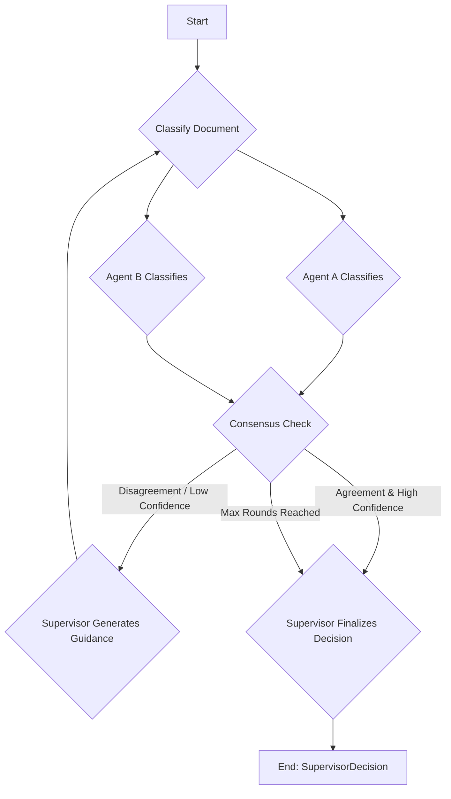

# System Architecture

This document outlines the architecture of the multi-agent document classification system. The system is designed to be robust and reliable, leveraging a "debate" and "reconciliation" pattern between agents to achieve high-quality classification results based on a predefined rubric.

## Core Components

The system is composed of three primary agents, each with a distinct role:

1.  **Worker Agents (Agent A & Agent B)**:
    -   **Responsibility**: Independently classify a given document according to the rules defined in `src/rubric.py`.
    -   **Output**: Each worker agent produces an `AgentVote`, which is a Pydantic model containing the `classification` label, a `confidence` score (0.0 to 1.0), and a `reason` for its decision.
    -   **Implementation**: These agents are powered by LLMs (e.g., GPT-4) and use LangChain's `with_structured_output` feature to guarantee the format of their `AgentVote`.

2.  **Supervisor Agent**:
    -   **Responsibility**: Orchestrates the classification process, manages the debate between worker agents, and makes the final decision. The supervisor does *not* classify the document itself.
    -   **Functions**:
        -   **Reconciliation**: If the worker agents disagree on the classification or their confidence is low, the supervisor generates neutral, evidence-based `ReconciliationGuidance`. This guidance is passed back to the worker agents to prompt them to reconsider their initial assessment in a subsequent round.
        -   **Finalization**: Once a consensus is reached or the maximum number of rounds is exceeded, the supervisor analyzes the final votes from both agents and produces the definitive `SupervisorDecision`. This final output includes the chosen classification, a synthesized rationale, and metadata about the classification process (e.g., rounds used, consensus status).

## Workflow

The classification process follows a state machine pattern, managed by the `DocumentClassifier` class.

1.  **Initiation**: A document is submitted for classification.
2.  **Parallel Classification**: `Agent A` and `Agent B` receive the same document and classify it in parallel.
3.  **Consensus Check**: The system checks if the agents' classification labels match and if their confidence scores meet the `min_confidence` threshold.
4.  **Reconciliation Loop (If Needed)**:
    -   If there is a disagreement or confidence is low, the `Supervisor Agent` is invoked to create `ReconciliationGuidance`.
    -   The process returns to Step 2, but this time the worker agents receive the original document *plus* the supervisor's guidance as additional context.
    -   This loop continues until consensus is reached or `max_rounds` is exceeded.
5.  **Finalization**:
    -   Once the loop terminates, the `Supervisor Agent` is invoked to make the final call.
    -   It synthesizes the information from the final agent votes to produce a comprehensive `SupervisorDecision`.

## Key Technologies

-   **LangChain**: Provides the core framework for interacting with LLMs, including prompt management and structured output capabilities.
-   **Pydantic**: Used extensively for defining data models (`AgentVote`, `SupervisorDecision`, etc.). This ensures that the output from the LLMs is structured, typed, and validated.
-   **Streamlit**: Powers the web-based user interface (`app.py`), allowing for easy document upload and configuration of the agents.
-   **OpenAI**: The primary LLM provider, accessed via the `ChatOpenAI` client. The architecture is flexible enough to support other providers.
-   **Python `unittest.mock`**: Crucial for the offline testing strategy (`scripts/dummy_test_cli.py`), allowing for end-to-end testing of the application logic without making live API calls.